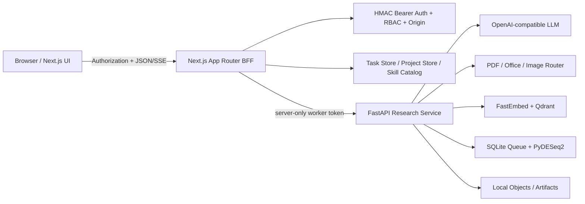

# BioFlow Studio

面向生命科学研究人员的可解释 Agent 工作台。它把“上传研究材料并提出问题”变成一条可审查、可干预、可恢复的任务链：文档解析与索引、RAG 证据检索、LLM 分析计划、人工审批、工作流执行、PyDESeq2 计算、结果交付与来源追溯。

GitHub：<https://github.com/fys-bot/bio-studio>

## 为什么做这个项目

本项目是对 Biomni 的产品逆向与前端改进，不以复刻页面数量为目标。核心取舍是把面试官能实际操作和验证的主流程做完整：

```text
登录与角色权限
  -> 项目 / 任务
  -> 上传 PDF、DOCX、XLSX、CSV、图片等真实材料
  -> 格式策略路由、清洗、分块、FastEmbed、Qdrant
  -> 提问与 RAG Trace
  -> 真实 LLM 生成结构化计划（SSE 展示等待与执行步骤）
  -> 人工审批
  -> 可拖拽工作流画布
  -> PyDESeq2 异步作业（SSE 展示 queued/running/completed）
  -> CSV、PNG、Markdown、Python 产物和 3D 结构联动
```

## 面试可见亮点

1. **不是静态聊天页**：任务具有服务端状态、独立 URL、失败/重试/取消、刷新恢复和结果血缘。
2. **真实模型答复与两条 SSE**：普通对话先检索可审计证据，再由服务端 LLM 返回自然语言分析；LLM 计划流展示“校验、Worker、模型等待、持久化、完成/失败”，计算流展示“连接、排队、PyDESeq2、产物生成”。
3. **可编辑工作流画布**：节点拖拽、空白平移、缩放、连线、状态传播、自动保存和命名版本。
4. **专业文件工作区**：列表与预览并排、分栏拖拽、DOCX 版式还原、PDF/图片原件预览、表格固定表头、全屏、下载、重解析和安全删除。
5. **真实 RAG 主链路**：格式路由、结构化清洗、分块、FastEmbed 384 维向量、Qdrant Local、BM25 + cosine + RRF，片段保留页码/工作表/解析器/分数。
6. **真实统计计算**：SQLite 作业队列、独立 Python 子进程、PyDESeq2、取消与失败恢复，输出结果表、火山图、报告和可复现脚本。
7. **角色和权限**：研究员、审阅者、管理员使用同一登录入口但权限不同；管理员可新增用户、分配角色、细调权限和停用账号。
8. **生命科学前端表达**：DNA/证据网络视觉、粒子降级策略、RAG 关系图、候选基因与残基联动、轻量 3D 坐标预览。
9. **多端工作流**：桌面侧栏、中屏压缩、移动端底栏；任务标题吸顶、分页吸底、内容级 Loading、响应式 Dialog 和安全区处理。
10. **工程边界可审查**：Bearer 鉴权、Origin 校验、类型化 API Client、解析器单测、真实链路 Smoke、格式检查和生产构建。

## 90 秒启动

### 环境

- Node.js 20+
- Python 3.12 推荐
- macOS/Linux；Windows 建议使用 WSL2

### 首次安装

```bash
npm install
python3 -m venv .venv
.venv/bin/pip install -r services/requirements.txt
cp .env.example .env.local
```

需要真实 LLM 计划时，只在 `.env.local` 填写服务端配置：

```bash
LLM_BASE_URL=https://your-provider.example/v1
LLM_MODEL=your-model
LLM_API_KEY=your-server-side-key
```

禁止将真实 Key 写进代码、README、截图、浏览器 Local Storage 或 Git。

### 启动

```bash
npm run dev
```

固定入口：<http://127.0.0.1:3000>

启动器使用 `.next-dev`，会探测并启动本机 Research Service。也可以分两个终端运行：

```bash
npm run services
npm run dev
```

浏览器入口始终保持 `3000`。如果默认 Research Service 或 Qdrant Local 数据目录被旧进程占用，启动器会自动探测后续 Worker 端口，并使用隔离运行目录启动兼容 Worker；控制台会记录内部 Worker 地址，页面和验收 URL 不需要改动。

若 8000 已有兼容 Worker，BFF 会复用；本地开发还会探测后续端口上的 `apiVersion >= 2` 服务。生产验证构建使用独立 `.next-verification`，不会覆盖开发缓存。

## 默认账号

登录页默认填写研究员账号。账号和密码均可通过环境变量覆盖；首次运行只将 scrypt 哈希写入本机运行目录。

| 角色 | 账号 | 密码 | 主要权限 |
| --- | --- | --- | --- |
| 研究员 | `researcher` | `bioflow2026` | 任务、文件、当前工作区技能、RAG、计划、运行、审阅 |
| 审阅者 | `reviewer` | `review2026` | 只读任务/文件/技能，填写审阅意见 |
| 管理员 | `admin` | `admin2026` | 全部权限和用户管理 |

角色必须与账号实际角色一致。例如选择“审阅者”但输入研究员账号会返回明确的 `ROLE_MISMATCH`，不会绕过授权。

## 从 0 到 1 验收

### 主线 A：真实计算 + SSE

1. 以研究员登录，进入“真实计算 + SSE”亮点实例。
2. 点击“使用示例数据”，系统绑定合成 Count 矩阵、样本元数据和协议说明；这些输入是演示种子，但 PyDESeq2 拟合是真实执行。
3. 完成数据格式、比较方案、物种和交付物四项澄清。
4. 选择快速/标准/深度研究模式并生成计划。
5. 展开“运行过程”，确认 SSE 持续显示当前步骤、进度、等待对象、耗时和可展开 payload。
6. 审批计划，在“输入与计算”确认 `condition/control/treated/batch/alpha`。
7. 启动计算，观察 queued -> running -> succeeded；刷新页面后作业状态仍可恢复。
8. 下载 `results.csv`、`volcano.png`、`report.md` 和 `analysis.py`。

### 主线 B：上传真实文档 + RAG

1. 打开文件中心，上传自己的 PDF、DOCX、XLSX、CSV、TSV、TXT、MD、PNG 或 JPG，单文件不超过 10MB。
2. 在并排预览区核对原始版式/正文、解析器、字符数、分块数、SHA-256 和索引状态。
3. 从文件预览创建分析任务，或在任务中绑定该文件。
4. 提问文档中特有内容，打开 Trace 核对命中文本、文件、页码/工作表、BM25/cosine/RRF 分数和最终参数绑定。
5. 删除一个用户上传文件，确认二次确认、Qdrant 清理、原件删除和任务绑定同步清除；演示种子应返回 `409`。

### 主线 C：前端创新交互

1. 打开工作流画布，拖拽节点、按住空白平移、缩放、适应视图并保存命名版本。
2. 切换时间线/画布运行过程，观察事件如何映射到节点状态。
3. 打开结果与 3D 结构，选择候选基因和残基，查看结构来源与证据联动。
4. 分别用 1024、768、390 宽度查看任务标题吸顶、局部 Loading、Dialog、工具坞、文件预览和吸底分页。

更完整的 5–8 分钟流程见 [演示脚本](./docs/演示脚本.md) 和 [原子级产品验收清单](./docs/原子级产品验收清单.md)。

## 架构



关键时序、模块边界、生产迁移方案见 [架构与交付说明](./docs/架构与交付说明.md)。

## 当前持久化：有数据库，但不是单一数据库

当前版本采用“本机混合持久化”，目的是让面试电脑零 Docker、零外部数据库、单命令启动：

| 存储 | 内容 | 是否真实持久化 |
| --- | --- | :---: |
| `data/state.json` | 任务、对话、笔记、画布布局、SSE 事件、RAG Trace | 是 |
| `data/catalog-state.json` | 技能启用状态和自建技能 | 是 |
| `$BIOFLOW_DATA_DIR/projects.json` | 项目目录 | 是 |
| `$BIOFLOW_DATA_DIR/auth-users.json` | 用户、scrypt 密码哈希、角色与权限 | 是 |
| `$BIOFLOW_DATA_DIR/research.sqlite` | 文档解析记录与计算作业 | 是 |
| `$BIOFLOW_DATA_DIR/qdrant` | FastEmbed 真实向量索引 | 是 |
| `$BIOFLOW_DATA_DIR/objects` | 上传原文件 | 是 |
| `$BIOFLOW_DATA_DIR/jobs` | 计算日志和结果产物 | 是 |

SQLite 当前使用 `records(kind,id,body)` 保存本地文档/作业 JSON，适合面试 Demo，不适合多人生产协作。生产目标是 PostgreSQL + 对象存储 + Qdrant Server + 专用队列 Worker；完整可执行 DDL 见 [数据库设计.sql](./docs/数据库设计.sql)。

## API 与安全

- 登录返回 HMAC-SHA256 Bearer Token，前端仅存当前标签页 `sessionStorage`。
- `lib/api-client.ts` 统一注入 `Authorization`，浏览器请求使用 `credentials: omit`。
- 服务端验证签名、8 小时过期时间、运行时 nonce、用户启用状态、角色和权限。
- Next.js 服务重启后旧 Token 失效，访问受保护页面会回到登录页。
- 所有写接口校验 `Origin` 与 `Host`，拒绝跨站写请求。
- 浏览器不获得 Worker Token、LLM Key、Qdrant Key、对象绝对路径或密码哈希。
- 用户上传文件不作为系统指令；OCR/LLM Prompt 明确将文档内容视为不可信数据。

完整 Method、Header、请求/响应 Schema、状态码、curl 和持久化映射见 [API 接口规范](./docs/API接口规范.md)。登录后也可在“我的 -> 开发与验收手册 -> API”下载接口规范、数据库 DDL 和 Research Service OpenAPI。

## 技术栈

### 前端与 BFF

- Next.js 14.2、React 18.3、TypeScript 5.5
- MUI 9 + MUI Icons + Emotion
- `docx-preview` 还原 DOCX 页面；浏览器原生 PDF iframe；结构化表格/正文回退
- CSS Design Tokens + 明确的桌面/中屏/移动端合同
- Fetch ReadableStream 解析带 Authorization 的 SSE；不使用无法自定义 Header 的原生 EventSource

### Research Service

- FastAPI、Uvicorn、Pydantic、HTTPX
- pypdf、pypdfium2、python-docx、openpyxl、Pillow
- FastEmbed、Qdrant Client、rank-bm25，可选 cross-encoder
- SQLite WAL、独立 Python 子进程、PyDESeq2
- 可选 Ollama-compatible 视觉 OCR

## 环境变量

以 [.env.example](./.env.example) 为模板。

| 变量 | 必填 | 作用 |
| --- | :---: | --- |
| `BIOFLOW_SESSION_SECRET` | 部署必填 | HMAC 会话密钥；开发仍会叠加进程 nonce |
| `LLM_BASE_URL` | 真实计划必填 | OpenAI-compatible `/v1` 基址 |
| `LLM_MODEL` | 真实计划必填 | 模型名 |
| `LLM_API_KEY` | 真实计划必填 | 仅服务端读取 |
| `BIOFLOW_WORKER_URL` | 否 | Research Service 地址，默认 `127.0.0.1:8000` |
| `BIOFLOW_WORKER_TOKEN` | 部署必填 | Next BFF 到 Worker 的服务端令牌 |
| `BIOFLOW_DATA_DIR` | 否 | 文档、SQLite、模型、对象和作业根目录 |
| `BIOFLOW_EMBED_MODEL` | 否 | 默认 multilingual MiniLM-L12-v2 |
| `QDRANT_URL/API_KEY` | 否 | 从 Local Mode 切换到 Qdrant Server |
| `BIOFLOW_RERANK_MODEL` | 否 | 启用 cross-encoder；未配置时明确显示 RRF |
| `BIOFLOW_OCR_URL/MODEL` | 否 | 扫描 PDF/图片视觉 OCR；未配置时返回 `needs_ocr` |

## 质量门禁

```bash
npm run typecheck
npm run format:check
npm run test:parsers
BIOFLOW_WORKER_URL=http://127.0.0.1:8000 npm run smoke
npm run build
git diff --check
```

- `npm run test:parsers`：DOCX、XLSX、文本 PDF、扫描 PDF、空页和损坏 Office。
- `npm run smoke`：登录、权限、任务、上传、Qdrant 检索、LLM/计划边界、PyDESeq2、文件删除和状态恢复。
- `npm run build`：使用 `.next-verification`，可与 3000 开发服务并行。
- 当前没有仓库内 Playwright E2E；五档 UI 采用浏览器真实交互与截图清单回归，属于下一步工程化项目。

## 需求文档完成度

需求文档“我们更关注”的四项能力均有可验收证据：

| 要求 | 当前结论 | 证据 |
| --- | --- | --- |
| 快速理解陌生 AI 产品 | 完成 | `analysis.md` 的目标用户、页面、状态、流程、取舍、技术推断与降级 |
| 转成可运行前端并形成后端闭环 | 完成 | 登录 -> 文件 -> RAG -> LLM 计划 -> 审批 -> 计算 -> 结果与恢复 |
| 合理取舍并加入创新交互 | 完成 | 工作流画布、SSE 双视图、文件工作区、RAG/3D 证据联动、粒子降级 |
| AI 辅助开发且保持质量与安全 | 完成 | [AI 使用说明](./docs/AI使用说明.md)、中文提交记录、测试门禁和密钥边界 |

按功能证据可计为 **4/4**；按生产成熟度不能计为 100%。最终提交仍需要项目所有者录制 5–8 分钟演示视频，仓库已提供脚本和 PPT。

## 诚实边界

已真实接入：文件解析、FastEmbed、Qdrant、本地混合检索、OpenAI-compatible LLM 计划、SSE、SQLite 作业队列和 PyDESeq2。

仍为 Adapter/降级实现：

- 视觉 OCR 路由已实现，但未配置模型时只返回 `needs_ocr`，不伪造正文。
- 知识图谱关系视图用于解释交互，尚未接入生产图数据库查询。
- 3D 使用真实/fixture PDB 坐标的轻量 Canvas 查看器，不是完整 Mol*。
- 只有 RNA-seq DESeq2 技能绑定了真实计算器；其他技能是可检索、可配置目录。
- 本地 JSON/SQLite/Qdrant Local 适合单机演示，不具备生产多租户、HA、审计保留、配额、杀毒和强沙箱。
- LLM 供应商可用性取决于 `.env.local` 配置和网络，不承诺外部 SLA。

## 交付材料

- [Biomni 逆向分析](./analysis.md)
- [架构与交付说明](./docs/架构与交付说明.md)
- [API 接口规范](./docs/API接口规范.md)
- [生产目标数据库 DDL](./docs/数据库设计.sql)
- [真实科研链路选型与验收](./docs/真实科研链路-选型与验收.md)
- [原子级产品验收清单](./docs/原子级产品验收清单.md)
- [AI 使用与 Review 记录](./docs/AI使用说明.md)
- [5–8 分钟演示脚本](./docs/演示脚本.md)
- [面试汇报 PPT 逐页设计方案](./docs/面试汇报PPT设计方案.md)
- [操作流程手册 DOCX](./deliverables/BioFlow-Studio操作流程手册.docx)
- [视觉与交互规范 PPTX](./deliverables/BioFlow-Studio视觉与交互规范-交付版.pptx)
