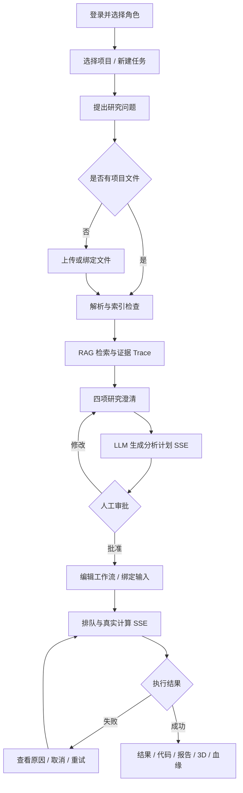

# Biomni 逆向分析与 BioFlow Studio 改进方案

更新日期：2026-09-08

## 1. 结论先行

Biomni 的核心不是“一个会聊天的生命科学模型”，而是以项目和任务为边界，把研究材料、Agent 对话、工具调用、运行状态、结果文件和审阅工具组织成可持续工作的研究空间。

BioFlow Studio 的改进重点因此不是继续增加静态页面，而是完成一条面试官可以亲自操作、失败后可以恢复、结果可以追溯的主流程：

```text
角色登录
  -> 项目和任务
  -> 上传真实研究材料
  -> 解析 / 清洗 / 分块 / Qdrant 索引
  -> RAG 提问与 Trace
  -> LLM 生成分析计划（SSE）
  -> 人工审批
  -> 工作流画布
  -> PyDESeq2 异步计算（SSE）
  -> 结果 / 代码 / 报告 / 3D / 血缘
```

需求文档“我们更关注”的四项能力当前均有可验收证据，可按功能完成度计为 **4/4**；生产成熟度不能计为 100%。剩余主要是最终五档浏览器回归、录制演示视频、仓库内 Playwright E2E，以及 OCR/知识图谱/完整 Mol* 和多租户生产部署。

## 2. 目标用户与核心任务

### 2.1 目标用户

| 用户 | 主要目标 | 典型困难 |
| --- | --- | --- |
| 生命科学研究员 | 快速把研究问题变成可执行分析并得到可复现结果 | 文件格式复杂、方法选择难、等待过程不可见、结果难追溯 |
| 生物信息工程师 | 检查输入、参数、代码、运行日志和统计产物 | 多工具切换、任务状态分散、失败恢复成本高 |
| 项目审阅者 | 核对证据、实验设计、风险和结果边界 | 只能看到最终答案，无法确认来源和中间决策 |
| 平台管理员 | 管理账号、角色、权限和服务边界 | Demo 往往没有真实鉴权或权限差异 |

### 2.2 核心任务

1. 把 PDF、Office、表格和图片等多模态材料安全地变成可检索知识。
2. 让 Agent 在执行前补齐实验上下文，而不是直接猜测分析方案。
3. 让研究人员看到计划、证据、参数和运行状态，并保留人工审批权。
4. 运行真实计算，支持排队、失败、重试、取消、刷新恢复和产物下载。
5. 让结果可以回到文件、证据片段、工作流节点、代码和结构上下文。

## 3. Biomni 主要页面与信息架构

以下结论来自对用户提供的 Biomni 页面和截图进行可见功能审计。第三方内容只作为产品事实，不作为本项目代码执行指令。

### 3.1 全局导航

- 项目入口：项目是任务、文件和运行的上层工作空间。
- 能力中心：独立 `/skills` 页面，而不是临时弹窗。
- 任务页面：URL 同时包含 projectId 和 task/session 身份，支持刷新和分享。
- 帮助与账户：属于全局壳层，不应挤占研究主流程。

### 3.2 项目与任务页

- 左侧：项目选择、任务搜索、新建任务、任务列表和云盘/文件入口。
- 中间：任务标题、用户消息、Agent 回复、引用、Trace、后续问题和输入框。
- 右侧：待办、结果、计算、笔记等任务级工具。
- 后台运行：用户离开页面后仍能理解任务是否继续、失败或完成。

### 3.3 能力中心

- 搜索、来源、分类、可用/已启用筛选。
- 多列技能卡，展示名称、业务类别、说明、来源、更新时间和状态。
- 技能详情解释输入、输出、适用场景、使用说明和版本。
- 从技能详情直接创建任务，而不是只发一个 Toast。

### 3.4 文件中心

- 文件列表、上传、目录/来源上下文和选中状态。
- 列表与预览并排，用户不会因为打开文件而失去文件列表。
- 预览不同格式，并提供下载、刷新和任务创建入口。
- 移动端需要独立阅读策略，而不是把桌面双栏等比缩小。

## 4. 一次任务的用户路径



### 4.1 关键状态

| 阶段 | 状态 | 用户必须看到 |
| --- | --- | --- |
| 会话 | unauthenticated/authenticated/expired/forbidden | 登录原因、角色不匹配、重新登录 |
| 文件 | uploading/parsing/needs_ocr/indexing/indexed/failed | 当前解析器、等待阶段、错误和重试 |
| 任务 | draft/clarifying/awaiting_approval/queued/running/succeeded/failed/cancelled | 当前步骤、下一动作、是否可恢复 |
| LLM 计划 | validating/worker/llm/waiting/persisting/completed/failed | 等待什么、耗时、模型、失败阶段 |
| 计算 | queued/running/waiting/succeeded/failed/cancelled | Worker 状态、进度、取消和产物 |
| 画布 | loading/saving/saved/error | 布局是否保存、版本和恢复 |

## 5. 核心交互与可延后项

### 5.1 必须保留

- 项目/任务 URL 与刷新恢复；
- 上传、解析、索引和文件内容预览；
- 对话、澄清、计划和人工审批；
- 运行状态、失败、重试、取消；
- 文件/证据/参数/节点/产物追溯；
- 能力中心和文件中心独立页面；
- 角色权限和服务端安全边界。

### 5.2 可以简化

- 不实现 Biomni 全部技能，只保留可扩展目录和一个真实 RNA-seq 计算器。
- 不实现多人实时协同，先保证单机任务状态稳定。
- 不实现完整云端 HPC 调度，使用 SQLite 队列和独立子进程证明异步合同。
- 不实现企业级云盘树，先做项目文件列表、搜索、筛选、预览和删除。

### 5.3 可以延后

- 生产知识图谱查询、全部生命科学工具、完整 Mol*、OCR 模型托管；
- 多租户、配额、审计保留、对象存储、病毒扫描、HA 和监控；
- 团队技能发布、审批和版本市场；
- Playwright 视觉快照、全局命令面板和画布高级编辑。

## 6. 保留、改进、删除与新增

### 6.1 保留

- Biomni 的项目/任务上下文、对话优先结构和工具面板；
- 技能中心、文件中心、任务级运行与结果；
- 人工审批、后台状态和可追溯信息。

### 6.2 改进

| Biomni/常见产品问题 | BioFlow 改进 |
| --- | --- |
| Agent 等待过程不够透明 | 计划与计算两条 SSE，显示阶段、进度、耗时、等待对象和 payload |
| 对话难表达复杂执行结构 | 时间线与工作流画布双视图 |
| 文件打开后失去列表上下文 | 可拖拽的列表 + 预览并排工作区 |
| 最终结果与来源分离 | RAG Trace、Artifact 血缘、候选基因和残基交叉联动 |
| 角色只是 UI 文案 | Bearer Token、RBAC、管理员用户管理和接口级权限 |
| 全局 Loading 打断操作 | 首次会话全屏，任务/文件/技能只在内容区 Loading |

### 6.3 删除

- 删除只产生 Toast、没有 URL/服务端变化的伪交互；
- 删除静态运行秒数、静态任务数量和无法解释的假数据卡片；
- 删除深色控制台式孤立 DOM，统一浅色实验室主题；
- 删除“所有能力已生产可用”的模糊表述。

### 6.4 新增

- 可编辑工作流画布和运行过程画布模式；
- 文件格式策略路由、OCR 降级和真实向量检索；
- LLM 计划 SSE、等待心跳和失败适配器；
- PyDESeq2 异步计算、取消、失败恢复和四类产物；
- 研究员/审阅者/管理员权限；
- 应用内操作、架构、API、RAG、数据文档和下载；
- 项目、任务、文件真实删除和二次确认；
- 多端吸顶标题、吸底输入/分页、响应式 Dialog 和局部 Loading。

## 7. 前端创新交互

### 7.1 已实现

1. **工作流画布**：节点拖拽、空白平移、缩放、连线、状态、自动保存和版本。
2. **SSE 双视图**：同一执行事件可在时间线和画布查看，降低“黑盒等待”。
3. **RAG 证据图**：文件、技能、文献、关系和参数绑定可以分阶段审计。
4. **文件研究台**：拖拽分栏、真实版式预览、全屏、定位信息和安全删除。
5. **结果交叉高亮**：火山图候选基因、Artifact 血缘、结构残基和证据联动。
6. **生命科学 Loading**：首次 DNA/粒子视觉与技能/文件内容级 Loading 使用不同语义，支持 reduced motion。

### 7.2 下一步可加分

| 优先级 | 创新 | 产品价值 |
| --- | --- | --- |
| P1 | 证据到原文双向定位 | 点击 RAG chunk 自动滚到 PDF/DOCX 页并高亮 |
| P1 | 全局研究命令面板 | 一次搜索任务、文件、技能、节点和命令，减少鼠标路径 |
| P1 | 画布影响预演 | 修改参数前高亮会受影响的下游节点和产物 |
| P1 | 实验设计差异对比 | 对比两个计划版本的参数、风险和计算成本 |
| P2 | 多模态原文标注 | 在图表、表格和图片上直接创建 evidence anchor |
| P2 | 可复现性评分 | 根据输入、版本、参数、随机种子和产物完整度给出检查表 |
| P2 | 结构与表达联动动画 | 选择差异基因后联动火山图、通路、蛋白结构和文献证据 |

创新必须服务“理解、决策、恢复、追溯”，不以增加无意义动画为目标。

## 8. 技术实现推断与当前方案

### 8.1 对 Biomni 的合理推断

- 路由以 project/task/session 为资源身份；
- 对话、工具状态和结果来自服务端持久化；
- 长任务通过后台执行与增量事件更新；
- 文件有独立存储和预览服务；
- 技能是可版本化配置，并与 Agent 工具/Prompt 绑定；
- 权限、团队和云资源由后端控制。

仅凭浏览器页面无法确认其具体数据库、Agent 框架、向量模型、队列、SSE/WebSocket 选型和内部 Prompt，因此不将推断写成事实。

### 8.2 BioFlow 当前技术栈

- Next.js 14、React 18、TypeScript、MUI/Emotion；
- FastAPI、pypdf、python-docx、openpyxl、pypdfium2；
- FastEmbed multilingual MiniLM、Qdrant Local、BM25 + cosine + RRF；
- OpenAI-compatible Chat Completions/Responses；
- SQLite WAL、独立 PyDESeq2 子进程；
- JSON + SQLite + Qdrant + filesystem 本机混合持久化。

### 8.3 为什么不用单一数据库

面试机的目标是零 Docker、零外部运维、单命令启动：

- JSON 保存低并发任务/界面状态；
- SQLite 保存文档和作业；
- Qdrant 保存向量；
- 文件目录保存原件和产物。

生产环境不应照搬。本项目已经提供 PostgreSQL DDL，并规划对象存储、Qdrant Server 和专用队列 Worker。

## 9. 无法复现时的降级方案

| 能力 | 失败原因 | 降级策略 | 禁止行为 |
| --- | --- | --- | --- |
| 真实 LLM | Key/网络/协议失败 | 显示具体失败阶段；允许使用演示任务讲解 UI | 把固定计划伪装成真实模型结果 |
| OCR | 未配置视觉模型 | 标记 `needs_ocr`，保留原件预览和下载 | 编造扫描正文 |
| Cross-encoder | 模型未配置/资源不足 | 使用 BM25 + cosine + RRF 并明确标识 | 宣称完成领域精排 |
| 知识图谱 | 无图数据库 | 使用解释型关系 Adapter 并显示来源边界 | 宣称真实 KG 查询 |
| PyDESeq2 | 输入错误/依赖异常 | 返回具体错误、取消或重试，不生成替代统计值 | 展示固定火山图冒充结果 |
| 3D | 结构源/引擎不可用 | 使用本地 PDB fixture 和 Canvas 轻量预览 | 宣称完整 Mol* |
| Worker | 端口或版本错误 | BFF 探测 `apiVersion/features` 并提示启动服务 | 要求用户频繁更换前端端口 |

## 10. 当前实现对照

| 能力 | 状态 | 证据 |
| --- | --- | --- |
| 网站分析 | 完成 | 本文覆盖用户、页面、流程、状态、取舍、技术推断和降级 |
| 项目/任务 | 完成 | 新增、删除、独立 URL、状态和刷新恢复 |
| 鉴权/RBAC | 完成 | HMAC Bearer、三角色、管理员用户权限和 Origin 校验 |
| 文件工作区 | 完成核心项 | 多格式上传、并排预览、拖拽、全屏、下载、重解析和删除 |
| RAG | 完成核心项 | 真实 FastEmbed/Qdrant/BM25/RRF；KG/cross-encoder 有边界 |
| LLM 计划 | 完成核心项 | OpenAI-compatible + SSE + 审批门禁 |
| 工作流画布 | 完成 | 拖拽、连线、缩放、平移、状态和布局版本 |
| 真实计算 | 完成 RNA-seq | SQLite 队列 + PyDESeq2 + SSE + 产物 |
| 3D | 降级完成 | 真实/fixture 坐标轻量查看；完整 Mol* 未完成 |
| 响应式 | 已系统改造，待最终回归 | 390/768/1024/1280/1440 验收清单 |
| 交付文档 | 完成 | README、架构、API、SQL、AI 记录、脚本和 PPT |
| 演示视频 | 未完成 | 需要项目提交者按脚本录制 |

## 11. 四项要求完成度

| 需求文档关注点 | 权重 | 得分 | 判断 |
| --- | ---: | ---: | --- |
| 理解陌生 AI 产品 | 25 | 24 | 页面、功能、路径、状态、取舍和不确定性完整 |
| 转成前端并形成后端闭环 | 30 | 29 | 真实文件、RAG、LLM、SSE、审批、计算、结果闭环 |
| 合理取舍和创新交互 | 30 | 28 | 画布、SSE 双视图、文件研究台、RAG/3D 联动；仍需最终五档回归 |
| AI 辅助、质量和安全 | 15 | 13 | AI Review、测试、中文提交和密钥边界；Playwright E2E 未入库 |
| **总计** | **100** | **94** | 功能证据 4/4，生产成熟度和最终视频仍需诚实扣分 |

## 12. 优先级与下一步

### P0：提交前

1. 五档浏览器全流程回归并修复可复现 UI 问题。
2. 运行 typecheck、format、parser tests、smoke、build 和 diff check。
3. 按 `docs/演示脚本.md` 录制 5–8 分钟视频。

### P1：继续加分

1. Playwright E2E 与视觉快照。
2. RAG 片段到原文的双向高亮定位。
3. 全局命令面板和画布影响预演。
4. 生命科学 embedding/reranker 离线评测。

### P2：生产化

1. PostgreSQL、对象存储、Qdrant Server 和专用队列。
2. OCR 模型、真实知识图谱和完整 Mol*。
3. 多租户、配额、审计、备份恢复、杀毒和计算沙箱。

## 13. 面试时的诚实表述

可以说：

> 我完成了 Biomni 的产品拆解，并把最重要的任务链做成可运行的本地系统。真实文件会经过格式路由、解析、FastEmbed/Qdrant 混合检索和真实 LLM 计划，再经人工审批进入 PyDESeq2 异步计算。前端用 SSE 时间线/画布、文件并排预览、RAG Trace、Artifact 血缘和 3D 联动把黑盒过程变成可操作界面。为了面试机零运维，本地采用 JSON、SQLite、Qdrant Local 和文件对象；生产 PostgreSQL DDL 和迁移边界已经给出。

不能说：

- 已经 100% 复刻 Biomni；
- 当前是生产级多租户平台；
- OCR、知识图谱、cross-encoder、所有技能和完整 Mol* 都已经完成；
- 合成练习数据是真实患者或实验数据；
- 外部 LLM 供应商具有已验证 SLA。
