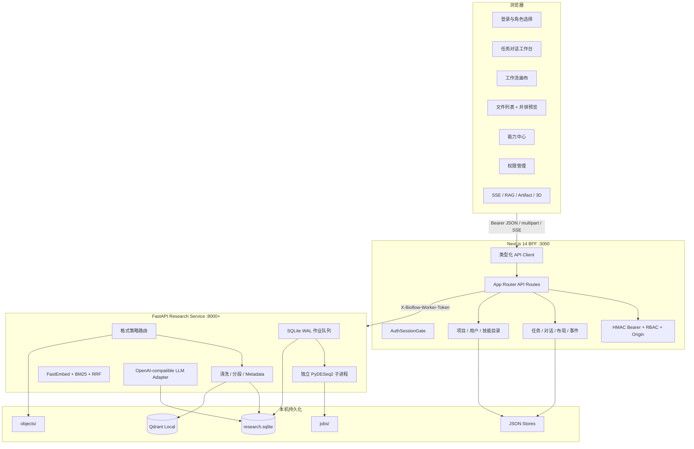
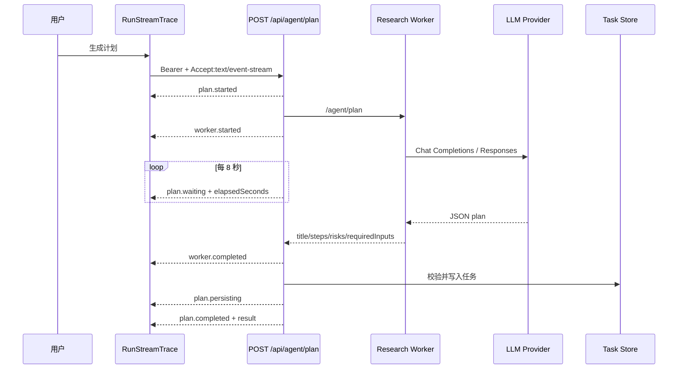
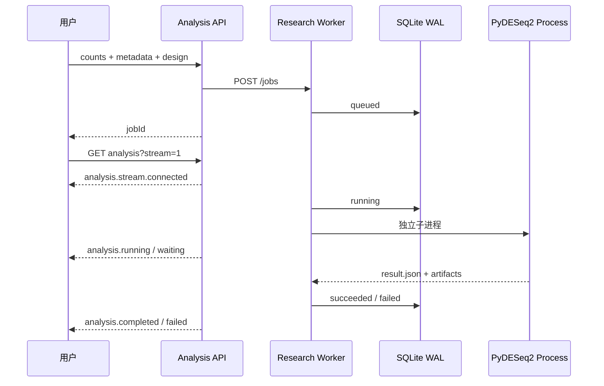
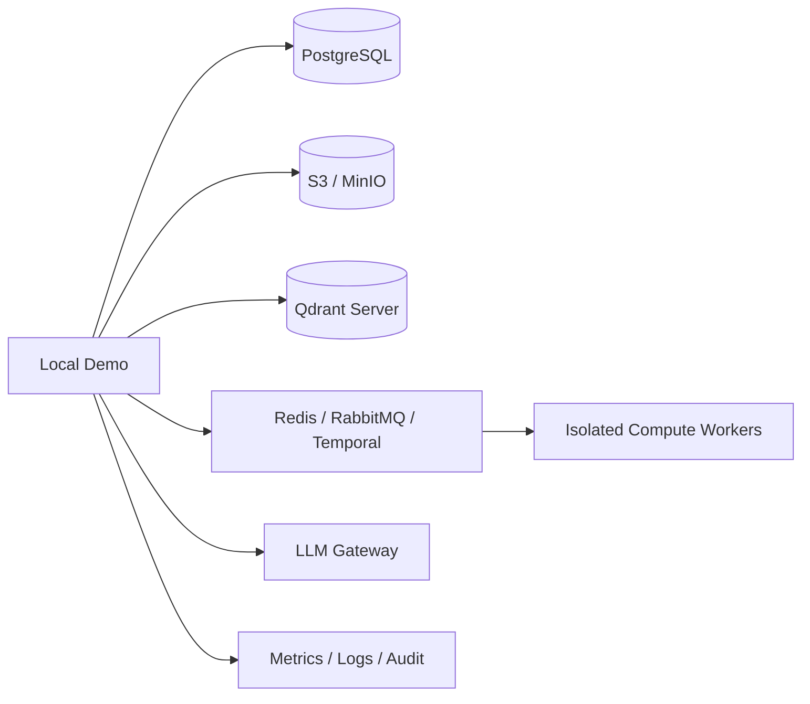

# BioFlow Studio 架构与交付说明

更新日期：2026-09-08

## 1. 产品目标

BioFlow Studio 不是普通 AI 对话框，也不是只展示视觉稿的前端 Demo。它解决的核心问题是：生命科学研究人员拿到一组文件和一个模糊问题后，如何在同一工作区完成材料理解、证据检索、分析计划、人工审批、真实计算、结果交付和过程追溯。

```text
科研问题 + 项目材料
  -> 文件识别 / 解析 / 清洗 / 分块 / 索引
  -> RAG 证据与参数绑定
  -> LLM 结构化分析计划
  -> 用户审查与审批
  -> 可编辑工作流
  -> 异步计算 / SSE / 失败恢复
  -> 结果、代码、报告、3D 与血缘
```

## 2. 运行时架构



### 2.1 为什么使用 BFF

- 浏览器只访问 `127.0.0.1:3000`，面试时不需要理解多个服务端口。
- Worker Token、LLM Key 和 Qdrant Key 不进入客户端 Bundle。
- Next.js 统一执行 Bearer 验证、角色权限和同源写保护。
- Python Worker 专注解析、向量检索和统计计算，避免在 React/Node 进程执行重任务。
- SSE 可以把 Worker/LLM/计算状态转换成统一的前端事件协议。

## 3. 前端模块边界

| 模块 | 主要组件 | 职责 | 关键体验 |
| --- | --- | --- | --- |
| 会话门禁 | `AuthSessionGate`、`login/page.tsx` | 无 Token 重定向、会话恢复、角色登录 | 服务重启后旧 Token 失效并回登录 |
| 全局壳层 | `GlobalRail`、`ModuleShell` | 工作台/能力/文件/权限导航 | 桌面侧栏、移动端底栏、账户菜单 |
| 任务工作台 | `app/page.tsx` | 组合任务状态、对话、澄清、计划、运行 | URL 驱动、内容级 Loading、标题吸顶 |
| 任务侧栏 | `TaskSidebar` | 搜索、分组、收藏、删除、数据集 | 状态色点、操作常显、二次确认 |
| 对话 | `ConversationPanel` | 任务消息、模式选择、引用、反馈 | 输入吸底、消息级 Trace、失败重试 |
| 计划 | `ClarificationCard`、计划组件 | 四项澄清、计划审查和审批 | 主次操作明确、长计划可折叠 |
| 画布 | `WorkflowCanvas` | 节点、边、平移、缩放、布局版本 | 状态传播、自动保存、运行过程画布视图 |
| 文件中心 | `FileCatalog`、`FilePreview` | 上传、筛选、预览、下载、删除 | 并排工作区、分栏拖拽、全屏与移动端阅读 |
| 能力中心 | `SkillCatalog` | 搜索、筛选、分页、启停、创建 | 状态/来源/分类明确、详情可创建任务 |
| 真实计算 | `RealAnalysisPanel` | 输入绑定、作业提交、SSE、结果 | 排队/运行/失败/取消/刷新恢复 |
| 结果与 3D | `ResultsPanel`、`ProteinStructureViewer` | 火山图、血缘、候选基因、结构 | 结果到证据、残基和节点的交叉联动 |
| 文档中心 | `DocumentationDrawer` | 上手、架构、API、前端、RAG、数据 | 应用内下载 API、DDL 和 Worker OpenAPI |

页面层不直接拼 Token、错误文案或 SSE 解析。`lib/api-client.ts` 负责统一 Authorization、超时、JSON 错误转换、下载和带 Header 的 Fetch Stream。

## 4. 鉴权与权限

### 4.1 当前实现

```text
POST /api/auth/login
  -> 校验 Origin
  -> 用户名 + scrypt 密码哈希
  -> 校验选择角色与账号实际角色一致
  -> HMAC-SHA256(payload, secret + runtime nonce)
  -> accessToken 返回浏览器
  -> sessionStorage
  -> Authorization: Bearer <token>
```

- Token 不是 JWT，没有把密钥或密码放进 Payload。
- 有效期 8 小时；Next 进程重启后 runtime nonce 变化，旧 Token 失效。
- 每次鉴权重新读取用户，停用账号、修改角色后旧 Token 无法继续访问。
- 写接口校验 `Origin.host === Host`。
- Worker 使用单独 `X-Bioflow-Worker-Token`，浏览器不可见。

### 4.2 RBAC

- **研究员**：任务、文件、当前工作区技能管理、RAG、计划、计算、研究笔记。
- **审阅者**：只读任务/文件/技能，允许写审阅意见，不能运行或删除。
- **管理员**：全部权限，并可创建用户、分配角色/权限、停用账号。

### 4.3 生产改造

当前 sessionStorage 方案满足本项目“Token 通过 Header”要求，但生产环境仍需强化 XSS 防护、CSP、Token 撤销和刷新机制。生产 DDL 已包含 `access_sessions.token_hash/revoked_at/expires_at`，可支持服务端撤销。

## 5. 当前持久化

当前并非“没有数据库”，而是为了面试交付采用混合持久化：

| 位置 | 数据 | 写入方式 | 特点 |
| --- | --- | --- | --- |
| `data/state.json` | 任务、对话、笔记、布局、运行事件、RAG Trace | 临时文件 + rename | 单机稳定、结构直观，不适合并发 |
| `data/catalog-state.json` | 自建技能、启用状态 | JSON | 服务端目录快照 |
| `$BIOFLOW_DATA_DIR/projects.json` | 项目 | 临时文件 + rename | 零数据库启动 |
| `$BIOFLOW_DATA_DIR/auth-users.json` | 用户、盐、scrypt 哈希、角色权限 | `0600` 文件 | 不保存明文密码 |
| `$BIOFLOW_DATA_DIR/research.sqlite` | 文档和作业 JSON Record | SQLite WAL | 支持作业重启恢复 |
| `$BIOFLOW_DATA_DIR/qdrant` | 384 维向量与 Metadata | Qdrant Local | 可无缝切 Server |
| `$BIOFLOW_DATA_DIR/objects` | 上传原件 | 内容标识路径 | 预览/下载与索引分离 |
| `$BIOFLOW_DATA_DIR/jobs` | 日志和结果文件 | 作业目录 | CSV/PNG/MD/PY 产物 |

SQLite 当前表：

```sql
CREATE TABLE records (
  kind TEXT,
  id TEXT,
  body TEXT,
  PRIMARY KEY(kind, id)
);
```

这是面试机低运维实现，不是生产数据库设计。生产目标 DDL 已拆分用户、项目、任务、工作流、运行事件、文档、分块、RAG、作业和产物，见 [`数据库设计.sql`](./数据库设计.sql)。

## 6. 文档解析与 RAG

### 6.1 策略路由

| 类型 | 优先策略 | 降级/边界 |
| --- | --- | --- |
| CSV/TSV | 结构画像、字段类型、缺失值、分组候选 | 超大表受列数/行数限制 |
| XLSX | openpyxl 只读提取工作表、值和表格 | 不执行宏和外部链接 |
| DOCX | python-docx 提取段落/表格；前端 docx-preview 还原版式 | 内嵌图像 OCR 未完成 |
| 文本 PDF | pypdf 按页提取并保留页定位 | 复杂跨页表格需专门解析器 |
| 扫描 PDF/图片 | pypdfium2 渲染后路由视觉 OCR | 未配置模型时返回 `needs_ocr` |
| TXT/MD | UTF-8 文本解析、标题/段落切分 | 不执行文档内指令 |

### 6.2 清洗和分块

- Unicode NFC、换行与空白规范化。
- PDF 页、DOCX 段落、工作表和表格边界优先于固定字符切分。
- 文本分块最多约 600 字符、80 字符重叠；表格分块重复列标题。
- 每个 chunk 保留 `fileId/fileName/chunkIndex/locator/origin/parser/sha256`。
- 原件是事实来源；向量库只保存检索向量、片段和引用 Metadata。

### 6.3 检索

```text
task.fileIds
  -> 校验所有文档 indexed
  -> FastEmbed query vector
  -> Qdrant cosine Top N
  -> BM25 Top N
  -> Reciprocal Rank Fusion
  -> optional cross-encoder
  -> RagTrace + grounding + tool choice
```

没有配置 `BIOFLOW_RERANK_MODEL` 时，UI 明确显示 `RRF(BM25, cosine)`，不会伪称 cross-encoder 已启用。

## 7. LLM 计划 SSE



Worker 不可用且错误允许回退时，BFF 可使用同一服务端配置直连 LLM，并发送 `llm.started/completed`。供应商返回 HTML、401、429、非法 JSON 或无步骤计划都会成为明确失败事件。

## 8. PyDESeq2 计算 SSE



输入校验包括：表格格式、Count 非负整数、样本 ID 对齐、分组列、control/treated 不同、每组最小重复数和 alpha 范围。子进程最长 300 秒；取消会终止运行进程，不生成替代结果。

## 9. 工作流与前端状态

### 9.1 状态机

```text
draft
  -> clarifying
  -> awaiting_approval
  -> queued
  -> running
  -> succeeded
      \-> failed -> retry -> running
      \-> cancelled
```

### 9.2 状态来源

- 服务端任务快照是业务真相。
- SSE 是增量通知，不是唯一状态存储。
- 画布位置、zoom、pan、额外边和 revision 按 taskId 保存。
- 对话、反馈、引用、Trace 和笔记按 taskId 保存。
- 切换任务只加载内容区，不遮挡全局导航和侧栏。

### 9.3 前端性能

- 粒子数量按视口与 DPR 分级，并尊重 `prefers-reduced-motion`。
- 首次会话恢复使用全页 Loading；资源切换使用模块内 Loading。
- 文件列表分页，预览仅加载当前文件；DOCX 在容器宽度变化时重算缩放。
- 工作流画布使用稳定容器尺寸，拖拽只更新必要状态并防抖持久化。
- SSE 使用 Fetch Reader，支持 Authorization Header；运行事件支持 `Last-Event-ID` 恢复。

## 10. 响应式合同

| 宽度 | 导航 | 工作台 | 弹层/预览 | 分页 |
| --- | --- | --- | --- | --- |
| `>=1280` | 左侧 Global Rail + 任务侧栏 | 主内容 + 右侧紧凑工具坞 | 居中 Dialog、文件并排预览 | 内容底部 |
| `1024–1279` | 侧栏压缩 | 控件密度下降、标题吸顶 | 窄 Dialog、工具抽屉 | 必须可见 |
| `768–1023` | 中屏导航 | 减少内边距、卡片收紧 | Drawer/窄弹层 | 浮动吸底 |
| `<768` | 底部一级导航 | 单列对话、输入吸底 | 文件预览全屏/底部策略 | 高于底栏吸底 |

验收视口固定为 390、768、1024、1280、1440。不能仅缩放大屏 CSS；每档都检查字号、行高、点击目标、滚动容器、z-index、safe-area 和 Esc/遮罩关闭。

## 11. API 分类

| 分类 | 代表接口 | 生产实体 |
| --- | --- | --- |
| 鉴权与用户 | `/api/auth/*`、`/api/admin/users` | users/roles/permissions/sessions |
| 项目与任务 | `/api/projects`、`/api/tasks/*` | projects/tasks/conversation |
| 文件与解析 | `/api/files/*` | documents/document_chunks/object storage |
| RAG | `/api/rag/*` | rag_traces/rag_trace_items/Qdrant |
| Agent 计划 | `/api/agent/plan` | tasks.plan/run_events |
| 运行与计算 | `/api/runs/*`、`/analysis` | runs/run_events/analysis_jobs/artifacts |
| 技能与布局 | `/api/skills/*`、`/workflows/*` | skills/workflow_* |
| 演示与诊断 | `/api/demo/*`、`/api/research/openapi` | local fixtures/diagnostics |

完整请求/响应规格见 [`API接口规范.md`](./API接口规范.md)。

## 12. 生产迁移



迁移顺序：

1. 先把任务、用户、项目、布局、运行事件和 RAG Trace 迁到 PostgreSQL。
2. 原件与产物迁到对象存储，数据库只保存 object key、SHA-256 和权限。
3. Qdrant Local 切换到 Server，保持 collection、payload 和 point ID 协议。
4. SQLite 轮询队列替换为可见性超时、重试和幂等的专用队列。
5. PyDESeq2 运行在资源隔离 Worker，增加 CPU/内存/磁盘配额与杀毒。
6. 增加访问审计、数据保留策略、租户隔离、备份恢复和监控告警。

## 13. 已知边界

- OCR Adapter 已实现，当前本机未配置视觉模型时不产生假正文。
- 知识图谱是可解释前端关系视图，未连接生产图数据库。
- 3D 是轻量 Canvas 结构查看器，完整 Mol* 尚未接入。
- 真实计算器当前只有 RNA-seq PyDESeq2；其他技能是目录和协议，不执行任意代码。
- 项目与任务在当前本地 Store 尚未建立真正外键，生产 DDL 已补 `tasks.project_id`。
- 本地 Token 没有持久化撤销表，服务重启整体失效；生产 DDL 已预留 Session 表。
- 当前没有仓库内 Playwright E2E，五档浏览器回归仍需要人工/工具执行。

## 14. 交付验收

```bash
npm run typecheck
npm run format:check
npm run test:parsers
BIOFLOW_WORKER_URL=http://127.0.0.1:8000 npm run smoke
npm run build
git diff --check
```

面试官可从“我的 -> 开发与验收手册”查看从登录到结果的七步操作、模块架构、API 分类、前端接入、RAG 链路与数据持久化，并下载 API Markdown、PostgreSQL DDL 和 Worker OpenAPI。
