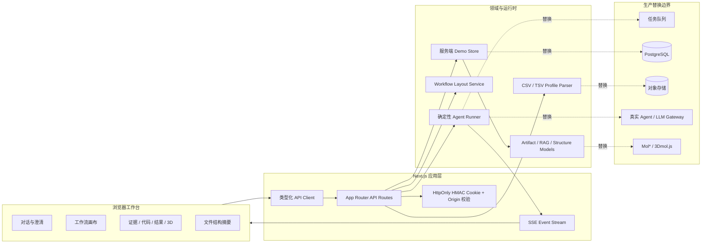
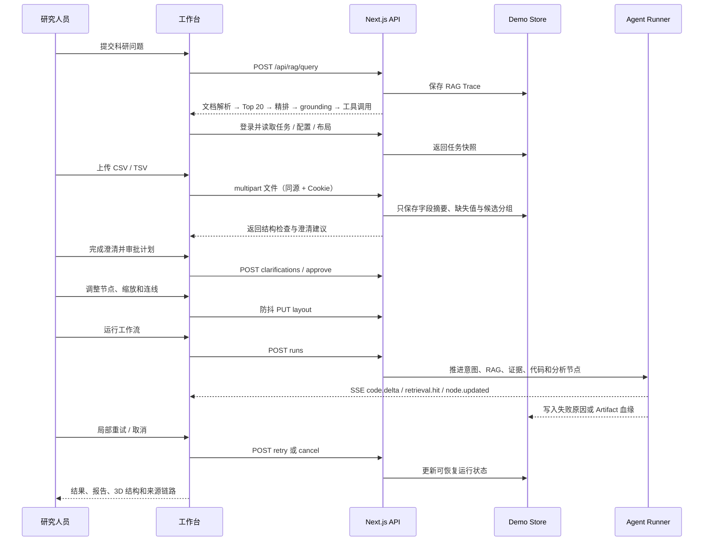

# BioFlow Studio 架构与交付说明

## 一、产品边界

BioFlow Studio 是面向生命科学研究人员的 Agent 工作台 Demo。核心价值不是把聊天窗口做得更像普通 AI，而是把一个模糊的 RNA-seq 科研问题，转成一条可解释、可审批、可干预、可恢复的分析链路：

```text
科研问题
  ↓
意图识别 → 项目文件检查 → RAG 检索 / 证据重排 → 参数绑定
  ↓                         ↓
结构化澄清 ← 服务端文件摘要    知识图谱与方法证据
  ↓
分析计划 → 用户审批 → 可编辑工作流 → Agent Runner
                                      ↓
              SSE 日志 / 代码流 / 失败重试 / 取消
                                      ↓
        火山图 + 候选基因 + Markdown 报告 + 3D 结构 + Artifact 血缘
```

## 二、分层架构



### 页面层

- `app/page.tsx`：只做任务状态、面板路由和接口编排。
- `components/ClarificationCard.tsx`：四步实验上下文澄清。
- `components/WorkflowCanvas.tsx`：节点拖拽、画布平移、缩放、临时连线和布局状态反馈。
- `components/ConversationPanel.tsx`：消息时间线、发送、模式切换和输入反馈。
- `components/InspectorDrawer.tsx`：待办、证据、日志、代码、结果、3D 六类研究工具。
- `components/results/*`：火山图、候选基因、Artifact 血缘和报告。
- `components/structure/*`：结构模型、Canvas 渲染适配器和业务查看器。
- `components/WorkspaceModal.tsx`：项目、文件、上传、布局和能力弹窗。
- `components/SkillCatalog.tsx`：独立能力中心列表、筛选、启停和技能详情。
- `components/FileCatalog.tsx`：独立文件中心、文件画像、上传和重新解析。
- `components/RagTracePanel.tsx`：消息级 RAG 全链路审计面板，支持 Top 20 展开和 JSON 复制。

### 服务端层

| 能力       | 接口                                             | 说明                                                                             |
| ---------- | ------------------------------------------------ | -------------------------------------------------------------------------------- |
| 登录       | `POST /api/auth/login`                           | 设置 HttpOnly 会话 Cookie                                                        |
| 任务       | `GET/POST /api/tasks`、`GET /api/tasks/:taskId`  | 获取任务列表、创建持久化草稿或重置演示状态；任务页按 ID 读取快照                 |
| 澄清       | `POST /api/tasks/:taskId/clarifications`         | 校验四项分析上下文                                                               |
| 计划       | `POST /api/workflows/:workflowId/approve`        | 用户审批后进入可运行状态                                                         |
| 布局       | `GET/PUT/POST /api/workflows/:workflowId/layout` | 自动保存、读取和命名版本                                                         |
| 文件       | `POST /api/files/profile`                        | 服务端识别 CSV / TSV / XLSX / PDF / DOCX / TXT / MD，并返回解析与索引阶段摘要    |
| RAG 查询   | `POST /api/rag/query`                            | 创建结构化 RAG Trace（解析、切分、召回 Top 20、精排、图谱、grounding、工具调用） |
| RAG Trace  | `GET /api/rag/traces/:traceId`                   | 获取完整 Trace                                                                   |
| RAG 分阶段 | `GET /api/rag/traces/:traceId/:stage`            | 获取 documents/chunks/retrieval/rerank/graph/grounding/tools 任一阶段            |
| RAG 事件   | `GET /api/rag/traces/:traceId/events`            | 以 SSE 返回 Trace 完成事件                                                       |
| 运行       | `POST /api/runs`                                 | 启动确定性 Runner                                                                |
| 事件       | `GET /api/runs/:runId/events`                    | SSE 增量日志和代码流                                                             |
| 控制       | `POST /api/runs/:runId/cancel`                   | 取消运行                                                                         |
| 恢复       | `POST /api/runs/:runId/nodes/:nodeId/retry`      | 局部节点重试                                                                     |

## 三、关键时序



## 四、Mock 替换点

当前 Demo 通过确定性数据保证面试现场稳定，但替换边界已经显式保留：

1. `lib/store.ts` → 生产数据库与任务事件表；保留 `ResearchTask`、`RunEvent`、`ArtifactRecord` 领域类型。
2. `lib/tabular-profile.ts` → 数据服务或异步解析队列；前端协议继续只消费 `DataFileProfile`。
3. `lib/api-client.ts` → BFF / API Gateway；页面不直接依赖数据库或模型 SDK。
4. `Agent Runner` → 真实 Agent 编排器、工具调用和队列；SSE 事件类型继续作为可观测协议。
5. `ProteinStructureViewer` → Mol\* / 3Dmol.js；业务层继续通过 accession、残基选择和证据联动。
6. `data/state.json` → PostgreSQL + 对象存储；演示环境保留本地持久化，方便离线面试。当前新建任务会保存草稿卡片和可访问快照，运行编排仍绑定 RNA-seq 演示任务，页面会明确提示这一演示边界。

## 五、演示前检查

```bash
nvm use
npm install
npm run dev
npm run smoke -- http://127.0.0.1:3000
```

打开 [http://127.0.0.1:3000](http://127.0.0.1:3000) 后按以下顺序演示：

1. 展开执行轨迹，解释 RAG 四阶段和知识图谱来源。
2. 上传 `demo-data/sample_metadata.tsv`，展示字段、缺失值和 `condition` 建议。
3. 应用建议并补完澄清，生成、审批分析计划。
4. 拖拽节点、缩放画布，等待“已自动保存”，点击“保存版本”，刷新后确认恢复。
5. 运行失败链路，打开证据和日志，执行局部重试。
6. 展示代码流、火山图、Artifact 血缘、报告下载和 3D 残基联动。

新建任务验收：在侧栏创建任务后，确认 URL 变为 `/projects/<projectId>/tasks/<taskId>`，刷新页面标题仍是新任务名称；新任务可以从草稿进入澄清、审批、运行和结果链路，不会误运行另一个任务。

## 六、安全与数据边界

- 所有写接口要求 HMAC 签名的 HttpOnly Cookie。
- 所有写请求校验 `Origin` 与 `Host`，拒绝跨站写入。
- 文件解析接口接受 CSV / TSV / XLSX / PDF / DOCX / TXT / MD，限制 5 MB；表格限制 512 列和 100,000 行。
- 原始文件单元格不会返回浏览器；任务只保存字段类型、缺失数量和分组建议。
- 真实 LLM / 数据库 / 对象存储密钥只能配置在服务端环境变量，不能进入客户端 bundle。
