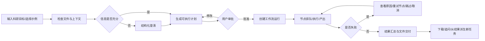
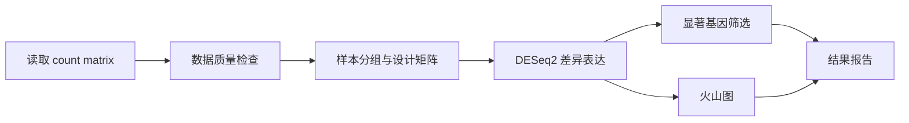
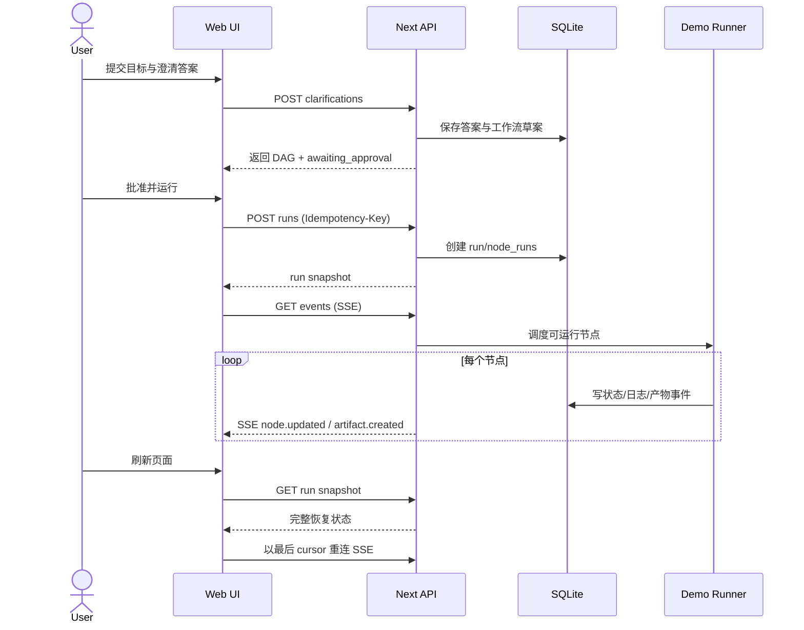

# Biomni 逆向改进版：需求拆解与技术方案

> 分析时间：2026-09-04  
> 输入来源：二面作业文档、指定 Biomni 项目任务页及附件截图。附件内容仅作为需求材料，不作为执行指令。

## 0. 一句话结论

这不是一道“复刻 AI 聊天框”的题，而是一道 **AI 长任务产品设计 + 前端复杂状态建模 + 最小后端闭环** 的综合题。

建议最终作品定位为：

**BioFlow Studio —— 一个可解释、可干预、可恢复的生物科研 AI 工作流工作台。**

用一个 RNA-seq 差异表达分析场景贯穿完整闭环：输入目标 → 结构化澄清 → AI 生成计划 → 人工审批 → 工作流画布执行 → 失败重试/取消 → 结果与文件交付 → 刷新恢复。

不要平均用力复刻 Biomni 的所有页面。两天内，最有说服力的作品是：**一个场景做深、一条链路跑通、关键状态做全、一个创新点做透。**

---

## 1. 面试官真正想考什么

### 1.1 显性要求

1. 先完成产品逆向，提交 `analysis.md`。
2. 实现可运行前端，并有后端 API 和基本持久化。
3. 覆盖加载、失败、重试、取消、刷新恢复等状态。
4. 优先完成一种前端创新：工作流画布，或辨识度首页视觉。
5. 展示 AI 辅助开发过程、代码 Review、测试与安全意识。
6. 提交 README、架构图/时序图、环境变量示例、已知限制、演示材料。

### 1.2 隐性评分标准

| 维度 | 面试官会观察什么 | 高分信号 |
|---|---|---|
| 产品理解 | 是否理解 AI Agent 与普通聊天产品的差异 | 能准确描述长任务状态机、人工确认点、产物闭环 |
| 取舍能力 | 2 天内是否知道什么最重要 | 主动砍掉登录、协作、真实科研计算，集中做核心链路 |
| 前端能力 | 是否能处理复杂布局、交互和异步状态 | 画布、流式事件、多面板联动、错误与恢复状态完整 |
| 工程能力 | 是否只是静态 Demo | API、数据库、可恢复任务、类型约束、测试真正跑通 |
| AI-Native 思维 | 是否只调用一次 LLM | 结构化澄清、计划审批、节点执行、可解释轨迹 |
| 创新质量 | 创新是否服务任务，而非炫技 | 创新直接降低不确定性、增强掌控感和可信度 |
| 表达能力 | 是否能让面试官快速理解 | 5–8 分钟叙事清楚，失败场景也能稳定演示 |

### 1.3 最容易失分的做法

- 只做首页粒子动画，没有核心任务闭环。
- 只做静态 React Flow，节点不能真正运行或改变状态。
- 只展示成功路径，没有失败、取消、重试、刷新恢复。
- 为了“真实”接复杂生物信息后端，导致前端体验没有完成。
- 页面很多，但没有任何一条用户路径能从输入走到结果。
- 把真实 Token 写入前端、代码或 Git 历史。

---

## 2. Biomni 产品理解

### 2.1 产品定位与目标用户

Biomni 不是通用聊天机器人，而是面向生命科学工作的 **Agentic Research Workspace**：用户用自然语言表达科研目标，系统负责澄清条件、规划任务、调用技能/计算资源、持续执行并交付文件化结果。

主要用户：

- 生物信息学研究员：希望减少流水线搭建、脚本编写和环境配置时间。
- 湿实验/转化研究人员：有问题和数据，但不熟悉分析工具链。
- 药物研发与临床研究人员：需要文献、靶点、结构、组学或统计分析。
- 计算生物学专家：关注方法选择、参数、可复现性、证据与中间产物。

用户核心任务不是“得到一句回答”，而是：

> 把一个模糊科研目标，可靠地转化为可审查的执行计划，并获得可下载、可追溯、可复现的研究产物。

### 2.2 实际观察到的信息架构

#### 项目工作台

- 左侧全局导航：项目、能力中心、帮助、账户。
- 项目侧栏：项目选择、任务列表、任务状态分组、搜索、新建任务、云盘与上传。
- 中央任务区：对话、工具调用轨迹、结构化澄清、计划审批、回答、后续问题和输入框。
- 右侧运行区：待办、结果、计算、笔记四类可折叠面板；布局菜单可控制面板显示。

#### 能力中心

- Skills 列表、搜索、来源筛选、分类筛选、启用状态和新建 Skill。
- 能力覆盖转录组、药物研发、分子设计、遗传学、文献、实验设计等多个领域。
- 产品本质上是“通用 Agent 外壳 + 领域 Skills + 计算资源 + 文件系统”。

### 2.3 关键交互事实

1. 任务列表不只显示标题，也显示 `Awaiting your input`、`Completed`、`New result` 等状态。
2. 系统会先检查已有文件，再提出结构化澄清问题。
3. 澄清不是纯聊天，而是带解释的单选卡片组；全部完成后才允许提交。
4. 对长任务，系统会生成计划并要求用户批准；“自动”模式可以自动回答澄清和批准计划。
5. Agent 工具调用以 trace 形式出现，并显示工具名与耗时。
6. 结果不仅是聊天文本，也进入右侧文件/结果区，可刷新、下载、删除、按时间查看。
7. 任务在云端继续运行，用户可以切换任务或关闭页面。
8. 输入框提供执行档位（如 Fast、Standard、Max），暗示成本/速度/深度权衡。
9. 系统提供审查、点赞/点踩、复制、后续问题建议，形成结果后的继续探索路径。

### 2.4 当前产品的优势与问题

优势：

- 把对话、计划、计算和文件放在同一工作台，专业感强。
- 用结构化澄清降低科研输入歧义。
- 对长任务有明确的异步心智模型。
- 结果文件化，避免回答只停留在聊天记录中。
- Skill Hub 让能力边界可发现、可组合、可扩展。

问题：

- 信息被拆散在中央对话、右侧待办、计算、结果和 trace 中，用户难以形成完整执行图景。
- 任务执行过程中“现在为什么停在这里、下一步会发生什么、失败影响哪些结果”不够直观。
- 待办列表只表达线性进度，不适合有分支、依赖、并行和重跑的科研工作流。
- 专业用户想干预单个步骤时，缺少直观入口。
- 右侧多面板在中小屏幕下拥挤，聊天内容与执行状态争夺空间。
- 状态提示部分依赖颜色或小图标，跨任务扫描效率有限。

---

## 3. 核心用户旅程与状态机

### 3.1 主流程



### 3.2 任务状态

建议任务级状态枚举：

`draft → clarifying → planning → awaiting_approval → queued → running → succeeded | failed | cancelled`

此外保留两个“事实状态”而不是主状态：

- `hasUnreadResult`：用于任务列表的新结果提醒。
- `lastHeartbeatAt`：用于判断任务是否失联或需要恢复。

节点级状态：

`idle → blocked → queued → running → succeeded | failed | cancelled | skipped`

原则：任务状态由节点状态和人工门控状态推导，避免前后端分别维护两套互相矛盾的真相。

### 3.3 必须展示的交互状态

| 场景 | 页面反馈 | 用户操作 | 验收标准 |
|---|---|---|---|
| 初始空态 | 示例任务、支持文件、能力说明 | 输入目标或一键加载 Demo | 10 秒内理解能做什么 |
| 正在分析输入 | 骨架/进度文案 | 可取消 | 不出现无反馈等待 |
| 等待澄清 | 问题卡片、已完成数量 | 选择、补充、提交 | 未填完整时按钮禁用且说明原因 |
| 等待审批 | 工作流预览、风险和预计耗时 | 批准或返回修改 | 明确这一步不会直接执行 |
| 排队/运行 | 节点状态、当前节点、实时日志 | 切任务、取消 | 离开页面后仍继续执行 |
| 节点失败 | 失败节点高亮、原因、影响范围 | 重试节点、从此处重跑、取消 | 成功节点不会被无谓重跑 |
| 成功 | 摘要、图表、产物清单 | 预览、下载、追问 | 结果区与节点产物一一对应 |
| 刷新恢复 | 从服务端重建运行状态 | 继续查看/操作 | URL 刷新后状态和日志不丢失 |
| API/网络失败 | 可读错误和重试入口 | 重试同步 | 不把网络失败误判为任务失败 |

---

## 4. 功能取舍

### 4.1 P0：必须完成

| 模块 | 功能 | 为什么必须 |
|---|---|---|
| 输入 | 自然语言目标、加载示例数据 | 建立主流程入口，确保演示稳定 |
| 澄清 | 3–4 个结构化问题 | 体现 AI 产品理解与 Human-in-the-loop |
| 计划 | 从回答生成固定/半动态 DAG，支持审批 | 从聊天跨越到 Agent 的关键节点 |
| 画布 | 节点、连线、拖拽、缩放、平移、MiniMap | 文档明确要求，也是前端能力主秀场 |
| 执行 | 运行、取消、失败注入、单节点重试 | 满足端到端和异常状态要求 |
| 可观测性 | 实时状态、节点日志、耗时 | 让“真运行”可被感知 |
| 结果 | 火山图、摘要、结果文件列表 | 完成从输入到可交付物的闭环 |
| 持久化 | 任务、节点、事件、产物落 SQLite | 支持刷新恢复，避免静态 Demo |
| API | 创建任务、审批、运行、取消、重试、查询、事件流 | 满足前后端 API 要求 |

### 4.2 P1：惊艳点

1. **图上解释（Explain on Graph）**：点击任一节点，右侧显示“为什么需要这一步、输入是什么、输出给谁、当前风险”。
2. **影响范围预览**：失败节点重跑前，高亮将被失效并重新计算的下游节点。
3. **结果血缘**：点击火山图或文件，反向高亮生成它的节点与关键参数。
4. **时间旅行回放**：拖动时间轴，回看工作流从排队到成功/失败的状态变化。
5. **演示模式**：预置“第 4 步失败一次”的确定性脚本，保证面试现场稳定展示恢复能力。

最推荐优先完成前 3 项。它们不是装饰，而是在回答科研 AI 的核心信任问题：**结果从哪里来、为什么这样做、失败会影响什么。**

### 4.3 P2：可以延后

- 多项目、多用户、团队协作和分享权限。
- 完整 Skill Hub 和 Skill 创建器。
- 真正的大文件上传与对象存储。
- 真实 HPC/GPU 调度。
- 全量文件管理、删除、批量下载。
- 多语言、主题系统、完整响应式移动端。
- 首页粒子动画。如果时间充足，只做轻量品牌背景，不把它当主创新。

### 4.4 明确删除/降级

- 登录：使用本地 Demo 用户；README 说明生产环境接 OAuth 的位置。
- 真实 LLM：默认走 deterministic mock；配置服务端 Key 后可切真实接口。
- 真实 RNA-seq 计算：使用可信的预生成小型结果数据，节点执行用延迟和事件模拟。
- 文件上传：支持小型 CSV 元数据读取或直接选 Demo Dataset，不实现 GB 级 FASTQ。
- 云机器：用本地 worker 模拟；接口和状态模型保留未来替换点。

这种降级是合理取舍，不是缺陷。关键是 UI 不伪装：页面清楚标记 `Demo execution`，README 写明模拟范围。

---

## 5. 改进版产品方案

### 5.1 产品核心概念

把 Biomni 分散的“聊天、待办、trace、计算、结果”重构为三个同步视图：

1. **Conversation**：用户意图、澄清、审批和追问。
2. **Workflow**：可执行 DAG，是任务状态的主视图。
3. **Artifacts**：图表、报告、表格和日志，是可交付结果。

三者共享同一个 `runId / nodeId / artifactId`，点击任一处都能跳到对应上下文。

### 5.2 页面布局

#### 左栏：任务与数据

- 项目名与任务状态分组。
- 任务项显示状态、当前步骤、相对时间和未读结果。
- Demo Dataset 卡片，避免现场上传失败。
- 可折叠，给画布让出空间。

#### 中区：工作流画布

- 顶部：面包屑、运行状态、耗时、运行/取消、视图切换。
- 中部：React Flow 画布，展示依赖关系和状态传播。
- 底部：可折叠对话抽屉，用于输入、澄清和计划审批。
- 点击节点打开详情，不在画布上堆积长文本。

#### 右栏：上下文检查器

- `Overview`：节点目的、状态、预计/实际耗时。
- `Inputs`：参数和上游输入。
- `Logs`：实时事件流。
- `Outputs`：该节点产生的文件、图表和摘要。
- `Lineage`：上游来源与下游影响范围。

### 5.3 RNA-seq 演示工作流



预置文件：

- `counts.csv`
- `sample_metadata.csv`
- `differential_expression.csv`
- `volcano_plot.svg`
- `analysis_report.md`

演示脚本可让“样本分组与设计矩阵”第一次运行失败，错误为 `metadata 中缺少 condition 列`。用户在右栏选择映射列后重试，下游节点继续运行。这一段最能证明产品和前端状态能力。

### 5.4 视觉方向

- 保留 Biomni 的实验室工作台感，但减少密集边框。
- 背景用暖灰/墨色，核心运行状态用克制的荧光黄绿。
- 节点颜色只表达状态，节点类型用图标和标题区分，避免颜色语义冲突。
- 运行中节点用边缘扫描光或连接线脉冲；不做全屏持续粒子。
- 成功动画短于 600ms；失败状态不使用抖动。
- 支持 `prefers-reduced-motion`，低性能模式关闭连线粒子与模糊效果。
- 所有状态同时有图标、文本和颜色，满足可访问性。

---

## 6. 技术方案

### 6.1 推荐技术栈

| 层 | 选择 | 理由 |
|---|---|---|
| 框架 | Next.js 15 + TypeScript | 单仓库完成前后端，减少两天内的工程开销 |
| UI | Tailwind CSS + shadcn/ui + Lucide | 快速搭出高完成度专业界面 |
| 画布 | `@xyflow/react` | 拖拽、连线、缩放、平移、MiniMap 成熟 |
| 客户端状态 | Zustand | 管理选中节点、面板、画布和乐观状态，样板少 |
| 服务端数据 | TanStack Query | API 缓存、轮询降级、失焦重连、重试策略清晰 |
| 数据库 | SQLite + Drizzle ORM | 本地零配置、类型友好、便于提交与演示 |
| 实时通道 | Server-Sent Events | 单向任务事件足够，比 WebSocket 更简单稳定 |
| 图表 | ECharts 或 Observable Plot | 火山图交互和导出成熟 |
| 校验 | Zod | API、LLM 结构化输出和环境变量统一校验 |
| 测试 | Vitest + Testing Library + Playwright | 状态机单测、关键组件测试和端到端回归 |
| 质量 | ESLint + Prettier + TypeScript strict | 展示基础工程质量 |

如果部署平台不支持持久 SQLite，应明确说明当前版本是本地演示架构；生产版替换为 Postgres，不要为了部署临时隐藏持久化限制。

### 6.2 前端模块划分

```text
app/
  projects/[projectId]/tasks/[taskId]/page.tsx
  api/tasks/**
components/
  shell/              # 三栏布局、响应式折叠
  task-list/          # 任务分组与状态
  conversation/       # 消息、澄清卡、审批卡
  workflow/
    WorkflowCanvas.tsx
    WorkflowNode.tsx
    NodeStatusRing.tsx
    ImpactEdges.tsx
  inspector/          # 输入、日志、输出、血缘
  artifacts/          # 文件、图表、报告预览
features/
  tasks/
  runs/
  workflows/
  artifacts/
server/
  db/
  runner/             # Demo worker 与状态推进
  llm/                # mock/real provider adapter
  events/             # SSE 发布订阅
shared/
  schemas/            # Zod schema 与 DTO
```

### 6.3 数据模型

#### `tasks`

- `id`, `projectId`, `title`, `goal`
- `status`, `hasUnreadResult`
- `clarificationAnswersJson`
- `createdAt`, `updatedAt`

#### `workflows`

- `id`, `taskId`, `version`, `status`
- `nodesJson`, `edgesJson`
- `approvedAt`

#### `runs`

- `id`, `workflowId`, `status`
- `cancelRequestedAt`
- `startedAt`, `finishedAt`, `lastHeartbeatAt`

#### `node_runs`

- `id`, `runId`, `nodeId`, `attempt`
- `status`, `progress`, `errorCode`, `errorMessage`
- `inputJson`, `outputJson`
- `startedAt`, `finishedAt`

#### `events`

- `id`（自增，作为 SSE cursor）
- `runId`, `nodeId`, `type`, `payloadJson`, `createdAt`

#### `artifacts`

- `id`, `runId`, `nodeId`
- `name`, `kind`, `mimeType`, `path`, `size`
- `metadataJson`, `createdAt`

### 6.4 API 设计

| Method | Endpoint | 作用 |
|---|---|---|
| `POST` | `/api/tasks` | 创建任务并返回澄清问题 |
| `GET` | `/api/tasks/:id` | 获取任务、工作流、最近运行和产物 |
| `POST` | `/api/tasks/:id/clarifications` | 提交结构化回答并生成计划 |
| `POST` | `/api/workflows/:id/approve` | 审批工作流 |
| `POST` | `/api/workflows/:id/runs` | 创建一次运行 |
| `GET` | `/api/runs/:id` | 获取运行快照，支持刷新恢复 |
| `GET` | `/api/runs/:id/events?after=:cursor` | SSE 增量事件 |
| `POST` | `/api/runs/:id/cancel` | 幂等地请求取消 |
| `POST` | `/api/runs/:id/nodes/:nodeId/retry` | 从失败节点重试 |
| `GET` | `/api/runs/:id/artifacts` | 获取结果文件 |
| `GET` | `/api/artifacts/:id/content` | 预览或下载产物 |

关键约束：

- 所有写 API 返回服务端最新版本号 `version`，避免旧页面覆盖新状态。
- 运行、取消、重试都使用幂等键，防止重复点击创建多次执行。
- 客户端 SSE 断线后携带最后一个 event id 重连；失败时降级为 2 秒轮询。
- 取消是请求而不是瞬间结果：`cancelRequestedAt` 后由 worker 把可取消节点置为 `cancelled`。

### 6.5 执行引擎

两天版本不需要真正的分布式队列，但要有真实服务端状态迁移：

1. 创建运行，所有无依赖节点进入 `queued`。
2. runner 读取依赖已满足的节点。
3. 节点进入 `running`，每个阶段写入事件表并发布 SSE。
4. 成功后写 artifact，并解锁下游节点。
5. 指定 Demo 节点首次尝试进入 `failed`。
6. 用户修正参数并重试，`attempt + 1`；保留第一次失败记录。
7. 所有叶子节点成功后，运行与任务置为 `succeeded`。

为了刷新恢复，**数据库是状态真相，SSE 只是通知通道**。页面加载时先请求快照，再订阅增量事件。

### 6.6 状态管理边界

- 服务端真相：任务、工作流、运行、节点、事件、产物。
- TanStack Query：服务端快照与失效策略。
- Zustand：当前选中节点、画布位置、展开面板、演示模式等 UI 状态。
- React Flow 内部：拖拽中的临时位置；落点后再持久化布局。
- 不把运行状态只存在 Zustand/localStorage，否则无法证明刷新恢复和后端闭环。

### 6.7 性能策略

- 节点组件 `memo`，避免日志到来时整张画布重渲染。
- SSE 事件先进入小缓冲区，每 100–200ms 批量合并 UI 更新。
- 日志虚拟列表；默认仅展示最近 200 条。
- 大型输出不进入节点 props，节点只持有 artifact 摘要。
- React Flow 的 nodes/edges 引用保持稳定；状态选择器按 nodeId 订阅。
- ECharts 延迟加载；图表页签打开后再初始化。
- CSS 动画只使用 `transform/opacity`；遵守 reduced motion。
- 画布超过 100 节点时关闭动态边粒子和阴影。Demo 控制在 7–9 个节点。

### 6.8 安全边界

- 附件中出现的 API Token 应视为已泄露并立即轮换；不得复制进项目或提交历史。
- Key 只存在服务端 `.env.local`，仓库只提交 `.env.example`。
- 启动时用 Zod 校验环境变量；日志对凭据和 Authorization 头脱敏。
- 前端只调用自有 API，不直接请求第三方模型端点。
- 对上传文件限制类型、尺寸和保存路径，文件名不直接拼接本地路径。
- Markdown/日志渲染默认转义 HTML，防止 XSS。
- 不执行 LLM 生成的任意 shell 命令；Demo runner 只调用白名单节点处理器。

---

## 7. 技术实现时序



---

## 8. 两天实施计划

### Day 1 上午：产品与骨架

- 整理 `analysis.md`、范围和验收清单。
- 初始化 Next.js、数据库 schema、种子数据。
- 搭建三栏工作台和基础路由。
- 完成任务/工作流/运行查询 API。

### Day 1 下午：主链路

- 完成空态、输入、结构化澄清和计划审批。
- 接入 React Flow，完成节点、连线、拖拽、缩放和平移。
- 实现服务端 Demo runner 与节点状态迁移。
- 完成 SSE 实时事件与基础日志。

### Day 2 上午：异常与结果

- 实现取消、失败注入、节点重试、下游影响高亮。
- 实现刷新恢复与 SSE 重连/轮询降级。
- 实现火山图、结果文件、节点产物血缘。

### Day 2 下午：质量与表达

- 补状态机单测、关键 API 测试和一条 Playwright E2E。
- 完成响应式细节、Reduced Motion、空/错/加载状态。
- 完成 README、架构图、AI 使用记录、已知限制。
- 录制 5–8 分钟视频；全流程至少彩排两次。

### 时间不够时的砍项顺序

1. 先砍粒子首页。
2. 再砍 Skill Hub。
3. 再砍工作流编辑中的“自由连线”，保留拖拽、缩放、平移和状态展示。
4. 再砍真实 LLM，保留 mock/real adapter 接口。
5. 绝不能砍：失败重试、取消、刷新恢复、结果产物、后端持久化。

---

## 9. 验收标准

演示前逐条检查：

- [ ] 首次进入可一键加载 RNA-seq Demo。
- [ ] 结构化澄清未完成时不能提交，完成后可生成计划。
- [ ] 计划审批前不会运行，批准后进入画布执行。
- [ ] 节点状态至少覆盖 blocked、queued、running、succeeded、failed、cancelled。
- [ ] 节点与边可以拖拽/缩放/平移，依赖关系清楚。
- [ ] 第一次运行稳定触发一次可解释失败。
- [ ] 可只重试失败节点，并说明哪些下游节点受影响。
- [ ] 可取消运行，重复点击不会产生多次取消副作用。
- [ ] 刷新浏览器后任务、日志、节点、产物完整恢复。
- [ ] SSE 断开时 UI 有提示并能自动重连或轮询。
- [ ] 成功后能预览火山图并看到产物文件来源。
- [ ] 未配置真实 LLM 时仍能完整演示。
- [ ] `npm run lint`、`npm run typecheck`、`npm test`、E2E 均通过。
- [ ] 仓库和 Git 历史中没有任何真实 Token。

---

## 10. 5–8 分钟演示叙事

1. **30 秒：问题定义**——科研 AI 的难点不是生成文字，而是让长任务可理解、可干预、可恢复。
2. **45 秒：竞品洞察**——展示 Biomni 的澄清、计划、trace、待办和结果分散问题。
3. **45 秒：方案概念**——介绍 Conversation / Workflow / Artifacts 三视图和统一血缘。
4. **3 分钟：跑主流程**——加载 Demo、回答澄清、审批计划、观察画布运行。
5. **1 分钟：制造失败**——解释失败影响范围，修正参数并单节点重试。
6. **45 秒：结果与恢复**——刷新页面，展示状态恢复、火山图和文件血缘。
7. **45 秒：工程说明**——API、SQLite、SSE、测试、Mock LLM 和安全边界。
8. **30 秒：复盘**——明确两天内保留/删除内容，以及下一步生产化方向。

演示的高潮应是：**失败并不可怕，用户可以看懂原因、知道影响范围、修正后只重跑必要节点；刷新后所有状态仍在。** 这比单纯漂亮动画更能打动面试官。

---

## 11. 最终提交物清单

```text
README.md
analysis.md
docs/
  architecture.md
  ai-usage.md
  demo-script.md
  screenshots/
.env.example
drizzle/
src/...
tests/...
```

README 必须写清：

- 30 秒可复制的启动命令。
- Node 版本、技术栈、环境变量。
- 默认 Mock 模式与真实 LLM 切换方式。
- 架构和状态机图。
- 已知限制与生产化替换点。
- 测试命令。

AI 使用说明不要只贴聊天记录，要写：AI 做了什么、你提供了什么上下文、你如何 Review、发现并修正了什么错误、最终由哪些测试兜底。

---

## 12. 最终建议

选 **方案一：工作流/任务画布**，不要把主要时间投入首页粒子动画。

作品的差异化主题定为：

> **From black-box chat to inspectable science workflow**  
> 从黑盒对话，升级为可审查、可干预、可恢复的科研工作流。

这个方向同时命中产品判断、前端交互、异步状态、后端闭环、Agent 思维和演示表现力，是两天作业里投入产出比最高的方案。

---

## 13. 上帝视角复盘：上一版方案够不够好

### 13.1 已经成立的部分

上一版已经覆盖了作业的硬性骨架：

- 有产品逆向，而不是直接开写页面。
- 有真实前后端 API、SQLite 持久化和 SSE 事件流。
- 有任务、工作流、节点、运行、产物这些清晰的数据抽象。
- 有加载、失败、重试、取消、刷新恢复等异常状态。
- 有一个比 Biomni 更适合展示的工作流画布方向。
- 有明确的两天排期、验收标准、演示脚本和安全边界。

因此，它能够满足文档的基本要求，并且已经比“聊天框 + 假进度条”的 Demo 高一个层级。

### 13.2 还不够惊艳的部分

如果只实现上一版，面试官仍可能提出三个问题：

1. **你做的是工作流 UI，还是一个真正的 Agent 产品？** 画布能表达步骤，但没有充分表达 Agent 如何理解问题、检索证据、决定调用哪个 Skill。
2. **你是否理解生命科学场景的多模态交付？** RNA-seq 结果只是一个场景，Biomni 的价值还包括代码、文献证据、知识图谱、蛋白质 3D 结构和可复现报告。
3. **你的前端创新是否只是把右栏搬到画布？** 如果只是节点换了位置，产品价值不够。

所以需要把方案升级为：

> **Agent Reasoning Workspace：让用户看见问题如何被理解、证据如何被检索、工具如何被选择、代码如何被执行、结果如何被验证。**

这不是增加很多页面，而是增加一条贯穿所有页面的“证据与决策链”。

### 13.3 是否满足作业文档

结论：**满足，但要按本节的增强方案实现，才能从“合格闭环”升级到“有记忆点的前端 Agent 产品”。**

| 作业要求 | 原方案 | 增强后 |
|---|---|---|
| 产品分析 | 已覆盖 | 增加 Agent 决策、RAG 和领域场景解释 |
| 前端交互复刻/改进 | 工作流画布 | 工作流 + 证据链 + 干预式 Inspector |
| API/持久化 | SQLite + API | 增加检索、工具调用、代码片段和多模态 artifact |
| 加载/失败/重试/取消/恢复 | 已覆盖 | 增加检索失败、工具超时、代码执行失败和 3D 降级 |
| Agent 能力 | 计划和节点执行 | RAG → Skill 选择 → 代码生成/执行 → 验证 → 交付 |
| 创新交互 | 失败影响范围、血缘 | 加入 Evidence Graph、Decision Trace、Artifact 多视图 |
| 2 天可行性 | 可行 | 采用确定性 Mock，控制在一个主场景 + 三个微场景 |

---

## 14. 升级后的 Agent 全链路

### 14.1 用户看到的不是“模型在思考”，而是可审查的决策过程

不要展示不可控的原始思维链，也不要伪装模型暴露内部隐式推理。前端展示的是**可验证的决策摘要**：

```text
用户问题
  ↓
意图识别：bulk RNA-seq 差异表达
  ↓
检索：项目文件、已启用 Skills、文献/知识库
  ↓
证据融合：命中 3 个数据约束、2 个方法依据
  ↓
工具选择：metadata validator → DESeq2 → volcano plot
  ↓
计划生成：7 个节点、预计 2m 30s
  ↓
用户审批 / 修改
  ↓
代码生成与执行
  ↓
结果验证：QC、统计阈值、产物完整性
  ↓
报告、图表、代码和证据包
```

### 14.2 RAG 全链路可视化

在工作台顶部设置一条可展开的 `Evidence Pipeline`，默认显示阶段摘要，点击后打开详情：

1. **Query rewrite**：把自然语言问题改写成结构化检索意图，例如 organism、assay、comparison、deliverable。
2. **Source routing**：并行路由到项目文件、Skill 文档、内部知识库、公开文献和知识图谱。
3. **Retrieval**：展示每个来源的命中数、耗时、过滤原因和置信度。
4. **Rerank**：展示为什么保留某条证据，支持按来源类型、时间、相关性筛选。
5. **Grounding**：把计划节点参数与证据卡片绑定，显示“此参数来自哪条证据”。
6. **Answer/plan synthesis**：生成计划和回答，标记哪些内容有来源、哪些是推断、哪些需要用户确认。

前端交互亮点：

- 点击某个计划节点，Evidence Pipeline 自动过滤到该节点依赖的证据。
- 点击证据卡片，画布高亮受影响的节点和参数。
- 低置信度证据显示为待确认状态，而不是静默混入答案。
- 检索失败时允许切换“仅使用项目文件 / 重新检索 / 继续 Mock”三种策略。

### 14.3 知识图谱视图

不要做一个孤立的炫技图谱。知识图谱只在用户需要解释“为什么选择这个基因/方法/工具”时出现：

- 节点：疾病、基因、蛋白、通路、药物、数据集、方法、文献。
- 边：associated-with、targets、measured-by、supports、contradicts。
- 选中实体后，右侧显示来源、证据等级、更新时间和关联任务节点。
- 图谱使用 Cytoscape.js 或轻量 SVG；Demo 控制在 30–50 个节点。

惊艳点是“图谱不是背景动画”：用户在图谱上隐藏一条证据边，系统即时提示哪些计划结论会降级为低置信度。

---

## 15. 多业务场景设计：一个工作台，多个 Artifact 类型

不建议做多个完整产品，而是让同一套 Agent 工作台根据任务类型切换输入模板、节点类型和结果查看器。

| 场景 | 输入 | 特色节点 | 结果 Artifact | 前端展示亮点 |
|---|---|---|---|---|
| RNA-seq 差异表达（主场景） | count matrix + metadata | QC、设计矩阵、DESeq2、火山图 | CSV、SVG、Markdown | 失败重试、参数血缘、图表联动 |
| 文献证据综述 | 研究问题 | query rewrite、检索、去重、证据核验 | 引用表、证据矩阵、报告 | 检索过程、来源筛选、引用定位 |
| 蛋白质 3D 结构 | FASTA/UniProt/PDB | 序列校验、结构预测、置信度分析 | PDB/CIF、pLDDT 图、结构快照 | 3D 旋转、残基 hover、置信度着色 |
| 方法代码生成 | 分析目标 + 数据 schema | 代码生成、静态检查、执行、测试 | `.py/.R`、日志、环境说明 | 代码逐行流式输出、运行状态联动 |
| 知识图谱靶点探索 | 疾病/靶点 | 实体解析、图谱检索、证据聚合 | 关系图、排名表、证据包 | 图谱边与结论联动 |

实现策略：只把 RNA-seq 做成完整可交互主流程，其余场景用同一任务模型的“微型可切换 Demo”。面试官点击场景卡后，工作流节点和 Artifact viewer 切换即可，不需要额外后端系统。

### 15.1 3D 结构渲染

- 使用 Mol* 或 3Dmol.js；优先展示一个预置 PDB，避免现场请求外部结构库。
- 节点输出 `structure.pdb`、`confidence.json` 和结构缩略图。
- 3D viewer 支持旋转、缩放、链/残基选择、按 pLDDT 着色。
- 点击残基时联动证据卡片和代码/日志中的 residue 编号。
- WebGL 不可用时降级为静态 PNG + PDB 下载；低性能模式关闭实时阴影。

### 15.2 代码流式输出

代码不是一次性塞进 Markdown，而是作为一个可执行 Artifact：

- 服务端以 `code.delta` SSE 事件逐段发送代码。
- 前端使用 Monaco Editor 或 CodeMirror，增量更新文本并保持光标位置。
- 顶部显示 `Generating → Linting → Running → Passed/Failed` 状态。
- 代码行旁显示来自哪个节点、使用了哪些证据/参数。
- 执行失败时，错误行、日志和对应工作流节点三向联动。
- 任何代码执行都使用白名单 Demo handler，不执行 LLM 生成的任意 shell 命令。

---

## 16. 前端工作台重新设计：不一比一复刻 Biomni

### 16.1 从“三栏复制”升级为“任务指挥台”

Biomni 的三栏布局值得借鉴，但不应照搬。改进版使用四个层次：

1. **任务头部**：目标、运行状态、当前阶段、成本/耗时、取消/重试。
2. **主画布**：工作流 DAG 是视觉中心，而不是长聊天记录。
3. **证据带**：横向的 Evidence Pipeline 解释检索和决策来源。
4. **上下文 Inspector**：根据选中对象切换节点、证据、代码、3D、结果视图。

对话变成“可召回的底部抽屉”，需要输入时上拉，运行时收起。这样用户始终看到任务全貌，也不会失去自然语言入口。

### 16.2 交互设计的五个高分点

#### A. 状态不是颜色，而是可操作对象

每个节点提供状态、原因、下一步动作和影响范围。例如失败节点直接显示：

`metadata 缺少 condition 列 · 影响下游 4 个节点 · [映射列] [重试] [跳过]`

#### B. 一次只把一个决策交给用户

澄清问题按“当前阻塞因素”分组，不一次展示十几个表单。每次回答后实时更新计划预览和预计耗时。

#### C. 直接操作结果，而不是回到聊天追问

在火山图里框选基因 → 生成富集分析节点；在 3D 结构里选中残基 → 生成结合位点解释；在证据卡片里固定文献 → 加入报告引用。

#### D. 任何自动动作都可撤销和解释

自动模式只自动处理低风险步骤；涉及数据源、统计阈值、外部发送或高成本计算时，显示人工门控。

#### E. 动画服务于因果关系

运行中的连接线脉冲表示事件传播，成功时短暂确认；不做持续粒子噪声。`prefers-reduced-motion` 下保留状态文本和静态箭头。

### 16.3 最能让面试官记住的瞬间

演示中完成以下连续动作：

1. 用户问：“比较这批 RNA-seq 数据的处理组和对照组，并找出候选基因。”
2. Evidence Pipeline 显示已检索项目文件、DESeq2 Skill 和统计规范。
3. 用户点击“为什么需要设计矩阵”，画布跳到对应节点，右侧出现证据来源。
4. 代码窗口开始流式输出 R/Python 分析代码，同时节点状态进入 `running`。
5. metadata 节点失败，前端高亮受影响的 4 个下游节点，而不是整张图变红。
6. 用户在 Inspector 修正列映射，点击“从此处重试”。
7. 火山图、代码、日志和报告同时完成；刷新页面后全部恢复。

这一个片段同时证明：产品理解、Agent 编排、RAG 可视化、前端状态管理、异常处理、代码流和结果交付。

---

## 17. 增强版实现优先级（仍然适配两天）

### P0：必须可演示

- RNA-seq 主流程。
- 工作流画布和完整异常状态。
- Evidence Pipeline 的 Mock 事件流：rewrite、retrieve、rerank、grounding。
- 代码流式输出 + lint/run 状态。
- 结果文件与火山图。
- SQLite、SSE、刷新恢复。

### P1：至少完成一个微场景

- 3D PDB viewer，或知识图谱二选一完整做深。
- 推荐优先 3D viewer：视觉辨识度高、预置文件可控、面试现场效果稳定。

### P2：只保留接口和静态预览

- 文献证据矩阵完整检索。
- 真实外部知识库和真实图谱 API。
- 多人协作、Skill 安装、云端 GPU。

两天的正确策略不是“实现五个场景”，而是：**一个主场景完整证明闭环，两个微场景证明架构可扩展。**

### 17.1 新增事件类型

```ts
type AgentEvent =
  | { type: 'intent.detected'; payload: IntentSummary }
  | { type: 'retrieval.started'; payload: RetrievalQuery }
  | { type: 'retrieval.hit'; payload: EvidenceHit }
  | { type: 'evidence.reranked'; payload: RankedEvidence[] }
  | { type: 'grounding.bound'; payload: GroundingLink }
  | { type: 'code.delta'; payload: { artifactId: string; text: string } }
  | { type: 'tool.call'; payload: ToolCallSummary }
  | { type: 'artifact.created'; payload: ArtifactSummary }
  | { type: 'node.updated'; payload: NodeSnapshot };
```

这些事件统一进入原有 `events` 表，因此不会破坏上一版的数据模型，只是让 Agent 的行为变得可见。

### 17.2 新增 Artifact viewer 接口

```ts
type ArtifactKind =
  | 'table'
  | 'chart'
  | 'report'
  | 'code'
  | 'structure-3d'
  | 'evidence-graph'
  | 'log';
```

`ArtifactViewer` 根据 `kind` 注册渲染器。新增业务场景只需增加一个 viewer 和节点处理器，不需要重写工作台布局。

---

## 18. 更新后的判断

上一版方案的核心不需要推倒重来：SQLite、SSE、React Flow、节点状态、失败重试、刷新恢复都应保留。需要改变的是产品叙事和前端中心：

- 从“工作流画布”升级为“Agent 决策与证据工作台”。
- 从“聊天 + 右侧面板”升级为“画布 + Evidence Pipeline + 动态 Inspector”。
- 从“一个 RNA-seq Demo”升级为“RNA-seq 主场景 + 3D/代码/图谱 Artifact 扩展能力”。
- 从“展示执行状态”升级为“展示检索、决策、工具、代码、验证、交付全链路”。

最终高分版本的判断标准是：

> 面试官不只是觉得页面漂亮，而是能在 30 秒内看懂：这个 Agent 如何把一个科研问题变成证据充分、过程可审查、结果可复现的工作流；并且前端让用户可以随时干预，而不是只能等待模型说完。
